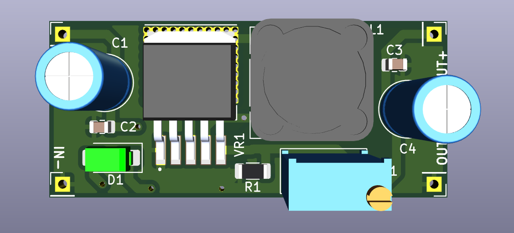
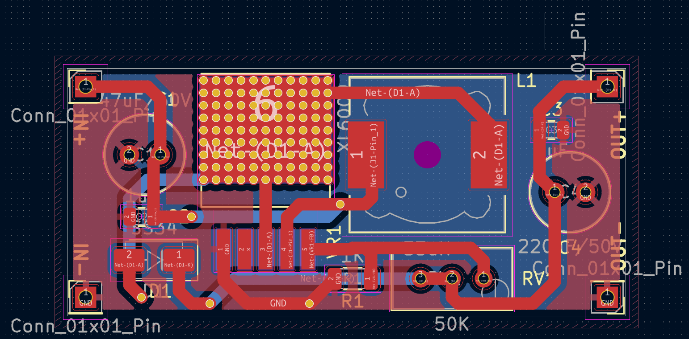

# DC-DC_BOOST-CONVERTER-PCB 
DC-DC BOOST CONVERTER using TI XL6009. Designed in KiCad

---

## 📌 Overview
This project implements a **DC-DC_BOOST-CONVERTER** based on the **Texas Instruments XL6009**.  
It is designed in **KiCad** with the following specifications:


## 📂 Repository Structure
- `TASK_BOOST-CONVERTER/Schematics/` → KiCad schematic files (`.kicad_sch`, `.kicad_pro`)  
- `TASK_BOOST-CONVERTER/PCB/` → PCB layout file (`.kicad_pcb`)  
- `BOOST_CONVERTER` → Snapshots of schematic & PCB (`.png`)  

---

## 📷 Design Media

### 🔹3D-VIEW


### 🔹Schematic


### 🔹Routing 


---

## 🛠 Tools Used
- **KiCad 7/8** → Schematic & PCB design  
- **BOM Generator** → CSV output  
- **GitHub** → Version control & project hosting  

---

## 🚀 Getting Started
Clone this repository:
```bash
git clone https://github.com/your-username/XL6009-DC-DC_BOOST-CONVERTER.git
